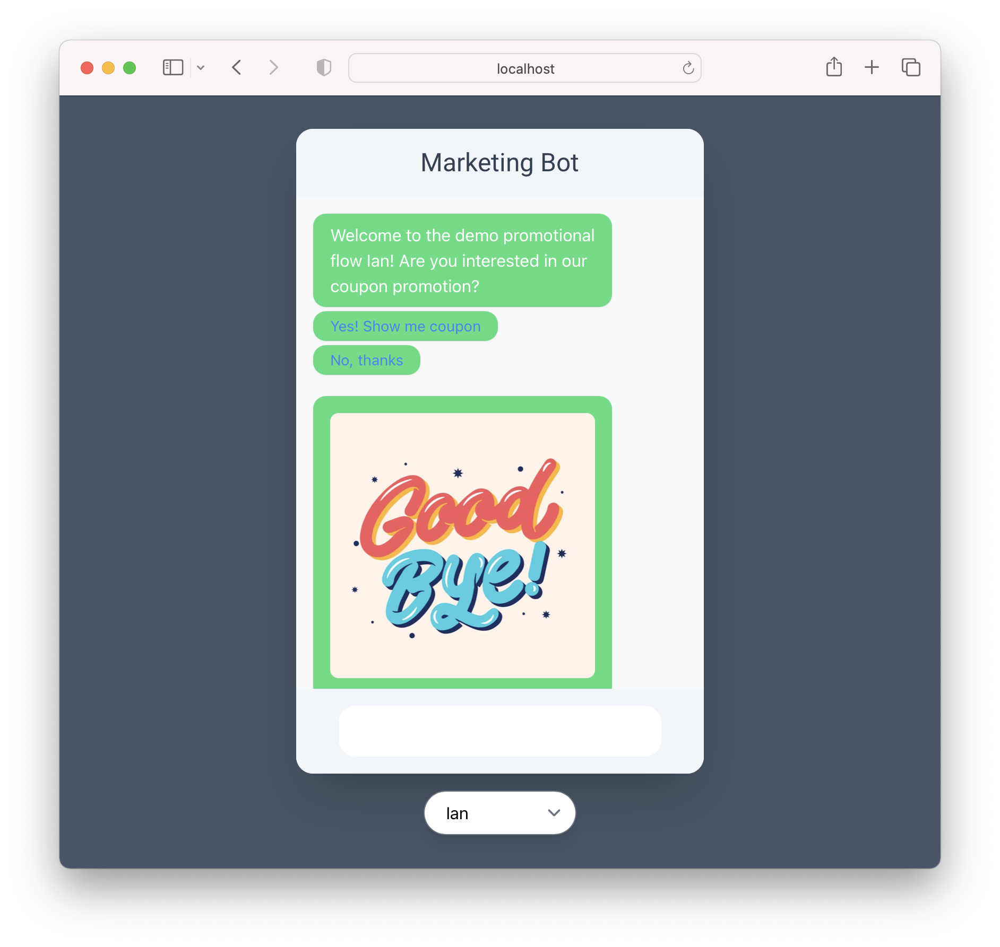
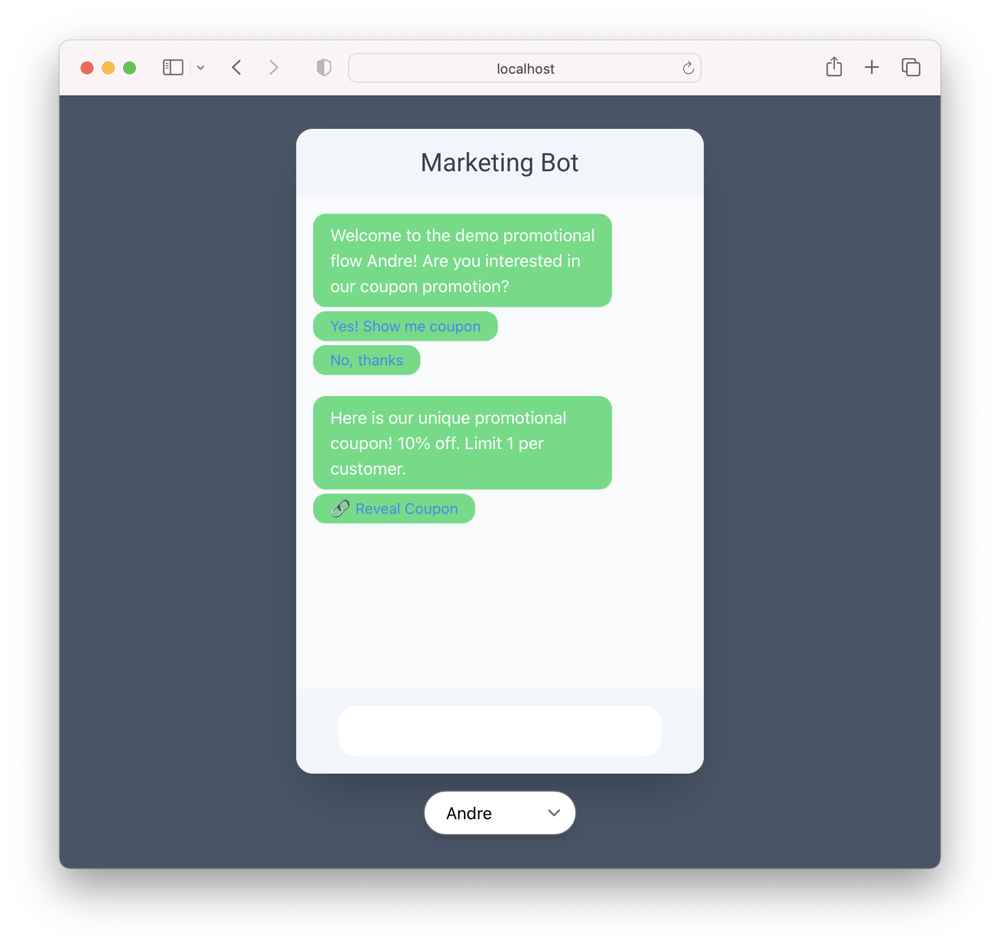

<h1>Marketing Bot</h1>

 

# Setup

See `backend` and `frontend` folders for readmes

## Deployment

marketbot.ianconceicao.com

Backend CD on Heroku, frontend CD on Netlify

 

## Limitations

On the **production** server there are some bugs that do not appear on local:

- Images don't load. Heroku does not support storage of static media. I did not realize this until after I deployed with them
- The messagaes load in backwards. I think this is because Heroku on production uses Postgres, but I used SQLlite on local, where the images load in normally.

There is no graphical representation of the click or impression data. Users can login to the admin page to see the data.
